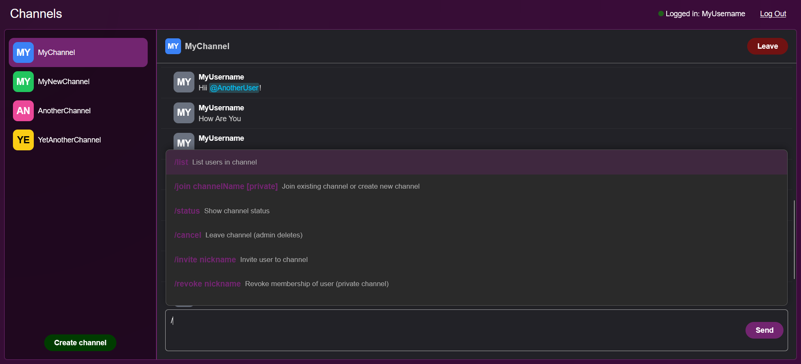

# Real-Time Channel-Based Chat Application (PWA)

**University project – Vývoj progresívnych webových aplikácií (Development of Progressive Web Applications)**  
**Authors:** [Ilia Poliak](https://github.com/IliaPoliak), [Dániel Ruzsik](https://github.com/ruzsikdaniel)

This project is a **Progressive Web Application (PWA)** that implements a real-time, channel-based chat system inspired by modern messaging platforms. The application combines **REST API** and **WebSocket communication** to support real-time messaging, notifications, and collaborative features.

## Features

- User registration, login, and logout with unique nickname and email
- Real-time channel-based messaging using WebSockets
- Public and private channels with role-based administration
- Command-line style interface for all channel and user actions
- Channel creation, joining, leaving, and deletion
- User invitations, revocations, kick voting, and permanent bans
- User mentions with visual highlighting (`@nickname`)
- Real-time typing indicators and live message preview
- Full message history with infinite scrolling
- Automatic cleanup of inactive channels after 30 days
- Responsive Progressive Web App (PWA) design for desktop and mobile
